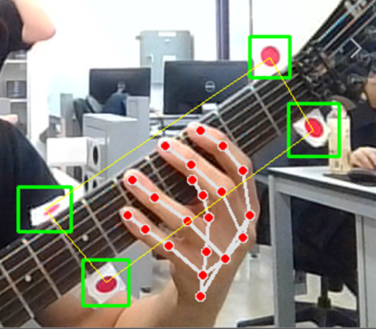
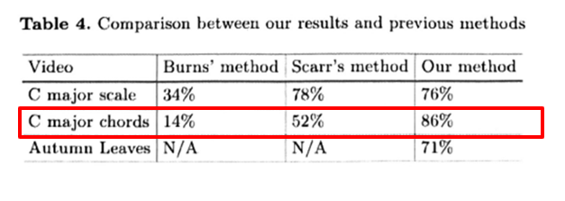

# Guitar Tablature Generation with Finger Detection

**Date:** 2023/06/19

**Author:** Doyoun Yu / Hanse Cho / Lucia Barnuevo

**Github:** [repository link]()

**Demo Video:** [Youtube link](https://youtu.be/6_bjW64lTkM)


# Introduction

In the multifaceted world of music technology, the application of innovative methods for enhancing the musical experience continues to captivate researchers and enthusiasts alike. One fascinating area of development is the generation of guitar tablature, utilizing motion detection markers, advanced tracking algorithms, and finger joint recognition models. This report explores a unique system employing a six-step process to derive accurate guitar tablature from video footage, thereby offering valuable insights into the guitarist's playing techniques.

The initiation of the process involves affixing four motion detection markers to the guitar neck, laying down the essential reference points for the fret positions. Subsequently, the Constrained Real-Time Maximum C-correlation Tracker (CSRT) algorithm, an integral part of the OpenCV library, is applied. This powerful tracking algorithm offers high precision but comes with the trade-off of computational complexity, thereby necessitating post-processing of the video rather than real-time analysis.

Significantly, the system employs MediaPipe's finger joint recognition model to pinpoint the position of the guitarist's fingertips, a novel approach not previously used in tablature generation. By doing so, it adds a layer of detail to the fretting hand's position, enabling the identification of the pressed string by comparing the relative location of the fingers to the frets and strings.

This framework also integrates specific algorithms to reduce noise and enhance accuracy. A notable feature includes a half-second delay before displaying the identified chord, helping to eliminate potential inaccuracies from unintentional or swift fretting hand movements.

Once a chord has been detected, the system generates the corresponding guitar tablature (TAB) note. This post-processing visualization provides critical feedback on the chords played during the recorded performance.

Historically, while several research studies have been undertaken in the field of automatic tablature generation,including Duke, B. and Salgian, A., the application of finger joint detection stands out as a remarkable and novel element in this system. In the subsequent sections of this report, we will delve deeper into each component and stage of this pioneering process, exploring its workings, advantages, and potential scope for refinement.


## 1. Requirements


###  Hardware

- NVDIA GeForce RTX 3060

## Software Installation


software specification are as follow :

| Program/library | Version                                                      |
| --------------- | ------------------------------------------------------------ |
| Python          | 3.9.7                                                        |
| opencv-python   | 3.4.11.45 (This version is required because opencv stoped supporting Tracker algorithm) |
| numpy           | 1.20.3                                                       |
| matplotlib      | 3.4.3                                                        |
| mediapipe       | 0.10.0                                                       |


## 2. Procedure

1. Guitar Neck Marker Tracking & Finger Joint Detection
2. Fret detection
3. Chord Recognition & Tablature

4. Evaluation

### 2-1-1. Guitar Neck Marker Tracking


  The guitar neck marker tracking involves monitoring the position of markers placed on the guitar neck, thereby establishing reference points for fret positions. This is achieved through the use of a tracking algorithm, namely the Constrained Real-Time Maximum C-correlation Tracker (CSRT) algorithm. The CSRT algorithm offers high-precision tracking at the expense of computational complexity, making it suitable for post-processing video recordings rather than real-time analysis.

The code for tracking the guitar neck markers begins with the creation of tracker instances using OpenCV. It then sets up a video capture object `cap` using the video file provided.

```python
trackers = [cv2.TrackerBoosting_create,
            cv2.TrackerMIL_create,
            cv2.TrackerKCF_create,
            cv2.TrackerTLD_create,
            cv2.TrackerMedianFlow_create,
            cv2.TrackerGOTURN_create,
            cv2.TrackerCSRT_create,
            cv2.TrackerMOSSE_create]

trackerIdx = 6 
trackers_instances = [None] * 4
isFirst = [True] * 4
bbox_center = [None] * 4

video_src = "test_0614.mp4"
cap = cv2.VideoCapture(video_src)
```


Next, the script enters a while loop that continues until the end of the video file. Each frame is read and processed within this loop. If the trackers are initialized (`trackers_instances[i]`), the tracker updates the bounding box (`bbox`) information for the marker in the current frame. If the tracker is successful in tracking the marker, a rectangle is drawn around it, and its center is stored. If all the trackers are successful in tracking, a square is drawn that connects all the marker centers.


```python
while cap.isOpened():
    ...
    for i in range(4):
        if trackers_instances[i]:
            ok, bbox = trackers_instances[i].update(frame)
            ...
    if all(bbox_center):
        pts = np.array(bbox_center, np.int32)
        pts = pts.reshape((-1,1,2))
        cv2.polylines(img_draw, [pts], True, (0,255,255))
    ...
```

Finally, the tracker is initialized by manually selecting a Region of Interest (ROI) by pressing the space key.


```python
if key == ord(' ') or (video_src != 0 and any(isFirst)):
    for i in range(4):
        if not trackers_instances[i]:
            isFirst[i] = False
            roi = cv2.selectROI(win_name, frame, False)
            if roi[2] and roi[3]:
                trackers_instances[i] = trackers[trackerIdx]()
                isInit = trackers_instances[i].init(frame, roi)
```




<center><strong>Located markers</strong></center>


### 2-1-2. Fingertip  Detection

  Fingertip detection plays a pivotal role in recognizing which guitar string is being pressed by the guitarist's hand. It uses the MediaPipe's finger joint recognition model, which identifies and locates the fingertips within the frame. This tracking of fingertips is done for each finger involved in guitar playing and contributes to accurate detection of the pressed strings and chords.


The code for fingertip detection starts by setting up the hand landmark model from the MediaPipe library.


```python
with handsModule.Hands(static_image_mode=False, min_detection_confidence=0.7, min_tracking_confidence=0.7, max_num_hands=1) as hands:
```


Then, within the video capture loop, each frame is processed by the hand landmark model to detect the hand and the landmarks. If hand landmarks are detected, the x and y coordinates of the fingertips (four fingers) are extracted.


```python
while cap.isOpened():
    ...
    if results.multi_hand_landmarks != None:
        for handLandmarks in results.multi_hand_landmarks:
            ...
            finger_1 = [handLandmarks.landmark[handsModule.HandLandmark(8).value].x, handLandmarks.landmark[handsModule.HandLandmark(8).value].y]
            finger_2 = [handLandmarks.landmark[handsModule.HandLandmark(12).value].x, handLandmarks.landmark[handsModule.HandLandmark(12).value].y]
            finger_3 = [handLandmarks.landmark[handsModule.HandLandmark(16).value].x, handLandmarks.landmark[handsModule.HandLandmark(16).value].y]
            finger_4 = [handLandmarks.landmark[handsModule.HandLandmark(20).value].x, handLandmarks.landmark[handsModule.HandLandmark(20).value].y]
    ...

```


Later, these fingertip coordinates are adjusted according to the frame dimensions, and a function named `myFunc.processor()` is called with the adjusted fingertip coordinates and the bounding box center coordinates.


```python
new_list = [
    (int(finger_1[0]*frame_width), int(finger_1[1]*frame_height)), 
    (int(finger_2[0]*frame_width), int(finger_2[1]*frame_height)), 
    (int(finger_3[0]*frame_width), int(finger_3[1]*frame_height)), 
    (int(finger_4[0]*frame_width), int(finger_4[1]*frame_height))
]
myFunc.processor(frame, bbox_center, new_list)

```


<center><strong>Detected finger joints</strong></center>

This method serves as an abstraction of the further processing and analysis of the fingertip and marker positions.

### 2-2. Fret detection

**Step 1**. Select [4 points] for **polylines()** from markers

- Position will remain even though the neck is tilted 
- This is for polylines() or distinguishing between two dots on the head and two on the body of a guitar.

- Function[arrange_rectangle_points()] Algorithm: 
  1. **Sort** the given points based on the **x-coordinate**.
  2. **Divide** the first two points and the last two points and sort each according to the **y-coordinate**.
  3. Return the results in the order of **top_left, top_right, bottom_right, and bottom_left.**
- Function[arrange_rectangle_points()] Definition:

```python
def arrange_rectangle_points(points):
    # Sort the given points based on the x-coordinate.
    points.sort(key = lambda x: x[0])

    # Divide the first two points and the last two points and sort each according to the y-coordinate.
    left_points = sorted(points[:2], key = lambda x: x[1])
    right_points = sorted(points[2:], key = lambda x: x[1])

    # Return the results in the order of top_left, top_right, bottom_right, and bottom_left.
    return [left_points[0], right_points[0], right_points[1], left_points[1]]
```

- Using Function[arrange_rectangle_points()]:

```python
rect_points = arrange_rectangle_points(points)
```

- Example image

|                             (X)                              |                             (O)                              |
| :----------------------------------------------------------: | :----------------------------------------------------------: |
|  |  |


**Step 2**. Detect [4 neck edge points] from the [neck markers]

- Since the neck marker is larger than the actual width of the guitar's neck, the distance between the neck markers(l1) and the width of the neck(l2) are used to calculate the neck edge points using their ratio.
- Function[find_points()] Algorithm:
  1. Find the **midpoint**.
  2. Calculate the **slope** between p1 and p2.
  3. Find **half of l1**.
  4. Calculate **half **of the distance for **l2** (l2 = l1 / ratio).
  5. Determine **p3** and **p4**.
- Function[find_points()] Definition:

```python
def find_points(p1, p2, ratio): # rato = l2 / l1
    # Find the midpoint.
    mid_point = ((p1[0] + p2[0])/2, (p1[1] + p2[1])/2)

    # Calculate the slope between p1 and p2.
    dx, dy = p2[0] - p1[0], p2[1] - p1[1]
    angle = math.atan2(dy, dx)

    # Find half of l1.
    half_l1 = math.sqrt((p2[0]-p1[0])**2 + (p2[1]-p1[1])**2) / 2

    # Calculate half of the distance for l2 (l2 = l1 / ratio).
    half_l2 = half_l1 * ratio

    # Determine p3 and p4.
    p3 = (mid_point[0] - half_l2 * math.cos(angle), mid_point[1] - half_l2 * math.sin(angle))
    p4 = (mid_point[0] + half_l2 * math.cos(angle), mid_point[1] + half_l2 * math.sin(angle))
    
    return np.round(p3, 3), np.round(p4, 3)
```

- Using Function[find_points()]:

```python
marker_fretEdge_ratio = 0.75 #ratio
left_marker_points = find_points(rect_points[0], rect_points[3], marker_fretEdge_ratio)
right_marker_points = find_points(rect_points[1], rect_points[2], marker_fretEdge_ratio)
```

- Example image


**Step 3**. Detect [6 strings] from [4 neck edge points]

- In the same manner as step 2, find the endpoints of lines 1 and 6 and divide these vertically into six parts to locate the six strings.

- Function[interpolate_points()] Algorithm:
  1. Divide the space between two points at regular intervals.
  2. Combine these divided points into a single array.
- Function[interpolate_points()] Definition:

```python
def interpolate_points(p1, p2, num_string):
    # Divide the space between two points at regular intervals.
    x_step = (p2[0] - p1[0]) / (num_string - 1)
    y_step = (p2[1] - p1[1]) / (num_string - 1)

    points = []
    for i in range(0, num_string):
        points.append((p1[0] + i * x_step, p1[1] + i * y_step))
        
    return points
```

- Using Function[interpolate_points()]:

```python
fretEdge_string_ratio = 0.8 # ratio
# Find the endpoints of lines 1 and 6.
left_string_points = find_points(left_marker_points[0], left_marker_points[1], fretEdge_string_ratio)
right_string_points = find_points(right_marker_points[0], right_marker_points[1], fretEdge_string_ratio)

# Index processing
fret_rect_points = left_marker_points + right_marker_points
fret_rect_points = [(int(round(point[0])), int(round(point[1]))) for point in fret_rect_points]      
test_tl = left_string_points[0]
test_bl = left_string_points[1]
test_tr = right_string_points[0]
test_br = right_string_points[1]

# Divide these vertically into six parts.
points_tl_bl = interpolate_points(test_tl, test_bl, 6)
points_tr_br = interpolate_points(test_tr, test_br, 6)
```

- Example image


**Step 4**. Detect [Fret points] from fixed ratios of guitar fret 

- The two points (end points of a string) are divided into equal proportions using a method similar to step 3.

- Algorithm:
  1. The points are divided into fixed ratios using the same method as step 3.
- Detail Code:

```python
divided_points = []
ratios = np.array([0, 1.5, 1.7, 1.85, 2.1, 2.25, 2.7]) / 12.05 # Converted to percentages

for i in range(6):
    # Calculating the vector between each left and right point
    vector = np.subtract(points_tr_br[i], points_tl_bl[i])
    previous_point = points_tl_bl[i]
    for ratio in ratios:
        # Calculating and storing each divided point
        divided_point = np.add(previous_point, vector * ratio)
        divided_points.append(tuple(divided_point))
        previous_point = divided_point
```

- Example image


### **Step 5**. Detect points from separated area 

- Shows middle point between lines

- In order to set the area for each other note, the focus of each of the front points is obtained.

- Algorithm:
  1. To determine the midpoints between each of fret points, similar as step 2.
- Detail Code:

```python
middle_points_vertical = []
# Split the list into groups of 6 points
divided_points_split = [divided_points[i::num_width] for i in range(num_width)]

# Iterate through each group of points
for points in divided_points_split:
    # Iterate through each vertical column
    for i in range(num_height-1):
        # Calculate the midpoint
        middle_point = ((points[i][0] + points[i+1][0]) / 2, (points[i][1] + points[i+1][1]) / 2)
        middle_points_vertical.append(middle_point)

```

- Example image


**Step 6**. Dividing Areas of each note of the guitar

- **Step 6-1.** Sorts Index

  - No index change even after guitar tilts
  - Function[sort_polygons()] Algorithm:
    1. Calculate the **center** coordinates for each polygon
    2. Find the **leftmost** points
    3. From the leftmost points, find the **topmost** point
    4. Calculate the absolute horizontal and vertical **distances** from each point to the leftmost point
    5. Sort the polygons first by **vertical** distance, then by **horizontal** distance
  - Function[sort_polygons()] Definition:

  ```python
  def sort_polygons(roiList):
      # Calculate the center coordinates for each polygon
      center_coordinates = [(np.mean(polygon, axis=0), idx) for idx, polygon in enumerate(roiList)]
  
      # Find the leftmost points
      x_small = min(center_coordinates, key=lambda x: x[0][0])[0][0]
      leftmost_points = [center for center in center_coordinates if (x_small - 10) <= center[0][0] <= (x_small + 10)]
  
      # From the leftmost points, find the topmost point
      topmost_leftmost_point = min(leftmost_points, key=lambda x: x[0][1])[0]
  
      # Calculate the absolute horizontal and vertical distances from each point to the leftmost point
      distances = [(idx, np.abs(center[0] - topmost_leftmost_point[0]), np.abs(center[1] - topmost_leftmost_point[1])) for center, idx in center_coordinates]
      # Sort the polygons first by vertical distance, then by horizontal distance
      sorted_indices = [idx for idx, dx, dy in sorted(distances, key=lambda x: (x[1], x[2]))]
  
      # Reorder the polygons according to the sorted indices
      sorted_roiList = [roiList[idx] for idx in sorted_indices]
  
      return sorted_roiLis
  ```

  - Detail Process:
    1. Determine the **regions for each note** in the acoustic guitar using the `middle_points_vertical`. For the 1st and 6th strings, the vertices are obtained by dividing the neck-marker points by the fret positions.
    2. Sort the divided regions by gradually increasing the index **downwards** and increasing from **left to right**.
  - Using Function[sort_polygons()] & Detail Code:

  ```python
  # ROI Setting
  roiList = []
  
  # Iterate over the sorted points and create a rectangle every 4 points
  ROI_height = num_height - 1
  
  # Set the region of interest for lines 2-5 from middle_points_vertical
  for i in range(0, len(middle_points_vertical) - (ROI_height + 1), 1):
  
      if i % ROI_height != ROI_height - 1:
          # Extract the vertices of the rectangle
          p1 = middle_points_vertical[i]
          p2 = middle_points_vertical[i + 1]
          p3 = middle_points_vertical[i + ROI_height]
          p4 = middle_points_vertical[i + ROI_height + 1]
  
          # Convert the coordinates of the points to int (OpenCV does not recognize floats)
          p1 = tuple(map(int, p1))
          p2 = tuple(map(int, p2))
          p3 = tuple(map(int, p3))
          p4 = tuple(map(int, p4))
  
          # Points forming the rectangle
          rect_points = [p1, p2, p3, p4]
          rect_points = arrange_rectangle_points(rect_points)
  
          roiList.extend([np.array(rect_points)])
  
          # Draw the rectangle
          cv2.polylines(frame, [np.array(rect_points, dtype=np.int32)], True, (0, 255, 0), 1)
  
  # Set the region of interest for line 6
  for i in range(0, num_width - 1, 1):
      p1 = rect_divided_points_6[i]
      p2 = rect_divided_points_6[i + 1]
      p3 = middle_points_vertical[i * ROI_height]
      p4 = middle_points_vertical[(i + 1) * ROI_height]
  
      # Convert the coordinates of the points to int (OpenCV does not recognize floats)
      p1 = tuple(map(int, p1))
      p2 = tuple(map(int, p2))
      p3 = tuple(map(int, p3))
      p4 = tuple(map(int, p4))
  
      # Points forming the rectangle
      rect_points = [p1, p2, p3, p4]
      rect_points = arrange_rectangle_points(rect_points)
      roiList.extend([np.array(rect_points)])
  
      # Draw the rectangle
      cv2.polylines(frame, [np.array(rect_points, dtype=np.int32)], True, (255, 255, 255), 1)
  
  # Set the region of interest for line 1
  for i in range(0, num_width - 1, 1):
      p1 = rect_divided_points_1[i]
      p2 = rect_divided_points_1[i + 1]
      p3 = middle_points_vertical[(i + 1) * ROI_height - 1]
      p4 = middle_points_vertical[(i + 2) * ROI_height - 1]
  
      # Convert the coordinates of the points to int (OpenCV does not recognize floats)
      p1 = tuple(map(int, p1))
      p2 = tuple(map(int, p2))
      p3 = tuple(map(int, p3))
      p4 = tuple(map(int, p4))
  
      # Points forming the rectangle
      rect_points = [p1, p2, p3, p4]
      rect_points = arrange_rectangle_points(rect_points)
      roiList.extend([np.array(rect_points)])
  
      # Draw the rectangle
      cv2.polylines(frame, [np.array(rect_points, dtype=np.int32)], True, (255, 255, 255), 1)
  
  # Sort the array
  sorted_roiList = sort_polygons(roiList)
  ```

  - Example image:

  


- **Step 6-2**. If finger point comes into pre-divided area -> enable Index

  - If a particular point is in a polygon, activate the index.
  - Function[check_point_in_polygon()] Algorithm:
    1. Set the region of polygon with the opencv [Path] library.
    2. Use the contents_point(), which is a built-in function of the Path library, to check whether the area of the point is included
  - Function[check_point_in_polygon()] Definition:

  ```python
  def check_point_in_polygon(point, polygon):
      path = Path(polygon)
      return path.contains_point(point)
  ```

  - Using Function[check_point_in_polygon()]:

  ```python
  if finger_points:
      for finger_point in finger_points:
          for idx, polygon in enumerate(sorted_roiList):
              if check_point_in_polygon(finger_point, polygon):
                  idx_pressed.append(idx)
                  draw_space(frame, polygon, color=(0, 0, 255))
  ```

  - Example image


### 2-3-1. Chord Recognition

- If root notes are detected from the relative finger position + kept for 0.5 seconds -> algorithm defines which chords is pressed 
- Function[find_chord()] Algorithm:
  1. If you include other codes in an array of pressed indexes, consider the code as pressed
- Function[find_chord()] Definition:

```python
def find_chord(idx_pressed):
    # Convert input list to set for efficient membership checks
    arr_set = set(idx_pressed)

    # Check for each condition and return appropriate value
    if {19, 26, 34}.issubset(arr_set): #C chord
        return 0
    elif {18, 25, 23}.issubset(arr_set): # G chord
        return 1
    elif {26, 27}.issubset(arr_set): # Am chord
        return 2
    elif {30, 19, 20}.issubset(arr_set): # F chord
        return 3
    elif {25, 26}.issubset(arr_set):    # Em chord
        return 4
    else:
        return -1
```

- Function[update_chord()] Algorithm:
  1. Check if a chord has been detected.
  2. If no chord is currently being tracked, continue tracking the chord.
  3. If a chord has been played (detected) for at least 0.5 seconds, record the chord and its duration in `Chord_Time`.
  4. If the chord changes, return to step 1.
- Function[update_chord()] Definition:

```python
def update_chord(idx_pressed):
    global last_chord
    global last_chord_time
    global temp_chord
    global detected_time
    chord_index = find_chord(idx_pressed)
    

    if chord_index != -1:  # 코드 감지됨
        if temp_chord is None: #
            temp_chord = chord_list[chord_index]
            detected_time = time.time()  # Store the current time
        else:
            if chord_list[chord_index] == temp_chord and time.time() - detected_time >= 0.5:
                if last_chord is not None and last_chord != temp_chord:
                    Chord_Time.append((last_chord, time.time() - detected_time))  
                last_chord = temp_chord
                temp_chord = None
            elif chord_list[chord_index] != temp_chord:
                temp_chord = chord_list[chord_index]
```

- Using Functions:

```python
chord_index = find_chord(idx_pressed)

update_chord(idx_pressed)
```

- Example image


### 2-3-2. Tablature Generation

- If a particular chord has been played, visualize it(Tablature).
- Algorithm:
  1. 약 1.4초마다 코드를 악보화 한다.
  2. 그보다 더 길면 코드를 여러번 표기한다. (Example. G코드가 2.8초 연주되면 Tablature에 코드를 2번 표기한다.)
- Detail Code:

```python
x_position = 300
for i, (chord, duration) in enumerate(Chord_Time):
    hyphens = round(duration*0.7)
    repr = chord_repr[chord]
    for _ in range(hyphens):
        for j, string in enumerate(repr):
            cv2.putText(frame, string, (x_position, 50 + j * 50), cv2.FONT_HERSHEY_SIMPLEX, 1, (255, 255, 255), 2)
        x_position += 50
```

- Example image:


### 2-4. Evaluation


### 2-4-1. Accuracy

|                | C    | G    | Am   | F    |
| -------------- | ---- | ---- | ---- | ---- |
| no. of Frames  | 118  | 61   | 43   | 117  |
| Correct Frames | 113  | 58   | 27   | 117  |
| Accuracy [%]   | 95.8 | 95.1 | 62.8 | 100  |


**Total Frames: 389**

**Transient Frames: 50**


The evaluation of the results of the guitar tablature generation method based on finger detection was conducted by assessing the method's accuracy across four chords - C, G, Am, and F. The accuracy was calculated by comparing the total number of frames for each chord against the number of frames in which the correct chord was identified.

For the C chord, out of 118 frames, the correct chord was identified in 113 frames, leading to an accuracy of 95.8%. Similarly, for the G chord, out of 61 frames, the chord was correctly identified in 58 frames, resulting in an accuracy of 95.1%. The F chord showed a perfect detection rate with all 117 frames correctly identified, leading to an accuracy of 100%.

However, the Am chord's accuracy was lower, with the correct chord identified in only 27 out of 43 frames, leading to an accuracy of 62.8%. This lower rate of accuracy for the Am chord is likely due to its unusual finger positioning, which might not be as effectively recognized by the MediaPipe model, which probably has less training data representing this particular chord shape.

This assumption is reinforced by the observed instability in the detection of finger joints during the Am chord frames - the detected joints were seen to vibrate significantly, leading to challenges in accurately identifying the chord. As such, it's evident that to enhance the model's ability to accurately detect and generate guitar tablatures for all possible chord shapes, it is crucial to train the model on more diverse datasets.

These datasets should ideally include various guitar chord shapes and finger positions, including less common ones like the Am chord. Custom guitar finger datasets that accurately represent the broad range of potential finger placements on a guitar can be an invaluable asset for improving the model's performance. In total, there were 389 frames and 50 transient frames, where the chord transition takes place, evaluated in this test.


### 2-4-2. Comparison with Previous Research




As indicated in the table provided above by Duke, B., and Salgian, A., our methodology significantly surpasses the accuracy obtained through their technique. However, given that our algorithm determines the chord merely by identifying root notes for the chord, a direct comparison between their data and ours may be inappropriate.


### 2-5. Limitations and Possible Improvements


While the "Guitar Tablature Generation with Finger Detection" project showcases a promising approach to automated tablature generation, it is crucial to address its limitations and identify potential areas for further improvement.

Firstly, the current system's requirement of using motion-detecting stickers for fret detection could be considered as somewhat intrusive and less user-friendly. A possible improvement in this regard could involve the application of advanced deep learning techniques for direct fret segmentation. This improvement would eliminate the need for users to physically attach markers on the guitar neck, thus providing a more seamless experience.

Secondly, the current model operates solely based on visual input for tablature generation. Integrating this model with sound recognition capabilities could vastly increase its potential. The fusion of visual data, primarily finger position, with auditory data like pitch and tempo could enhance the accuracy and richness of the generated tablatures.

Thirdly, at present, the model has been tested on a limited set of chords - namely C, G, Am, F, and Em. However, to be truly versatile and useful to a wide range of users, it is imperative to expand the system's chord detection capabilities to encompass a wider range of chords.

Lastly, the ability to detect guitar techniques, such as bending, sliding, palm muting, and picking harmonics, is an area that requires attention. Incorporating the detection of these techniques would add depth to the tablature generated, providing a more accurate representation of the original performance.

In summary, while the project demonstrates promising initial results, there are significant opportunities for improvements and enhancements to make it even more accurate and user-friendly. By addressing these limitations, we can take a significant step towards a more comprehensive and robust system for automated guitar tablature generation.


### 2-6. Conclusion

This project caters to guitarists seeking Tablature from video recordings. We have developed a basic prototype of such a Tablature. However, given the constraints of time and situation, we acknowledge limitations discussed in chapters 2-5, and recognize areas for potential enhancement. Before 'Guitar Tablature Generation with Finger Detection' can be commercialized, specific local configurations need to be addressed. Despite these challenges, the project holds substantial implications. First, it significantly improves upon the low yield rates found in prior studies (refer chapter 2-4-2) by employing 'finger joint detection' and the 'CSRT algorithm.' Second, while previous studies have explored chord detection, few have attempted to create image-based tablature. As this project pioneers in that domain, it is anticipated to generate significant demand once commercialized.